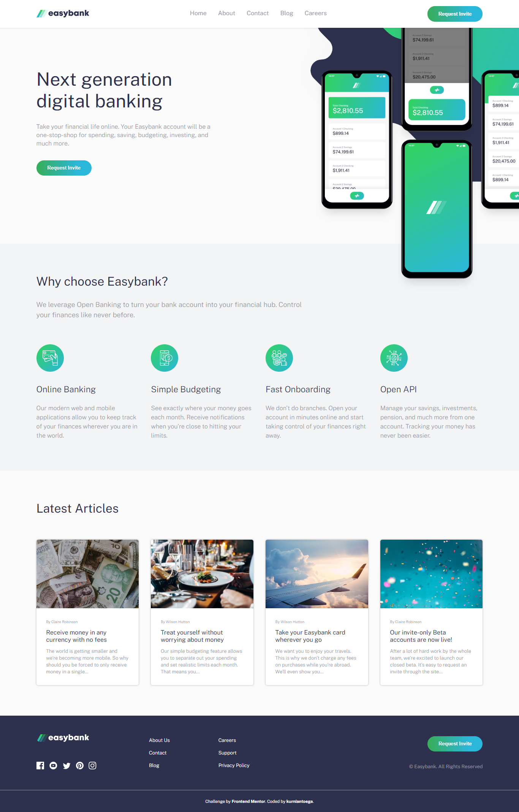

# Frontend Mentor - Easybank landing page solution

This is a solution to the [Easybank landing page challenge on Frontend Mentor](https://www.frontendmentor.io/challenges/easybank-landing-page-WaUhkoDN). Frontend Mentor challenges help you improve your coding skills by building realistic projects.

## Table of contents

- [Overview](#overview)
  - [The challenge](#the-challenge)
  - [Screenshot](#screenshot)
  - [Links](#links)
- [My process](#my-process)
  - [Built with](#built-with)
  - [What I learned](#what-i-learned)
- [Author](#author)

## Overview

### The challenge

Users should be able to:

- View the optimal layout for the site depending on their device's screen size
- See hover states for all interactive elements on the page

### Screenshot



### Links

- Solution URL: [https://github.com/kurniantoega/easybank-landing-page](https://github.com/kurniantoega/easybank-landing-page)
- Live Site URL: [https://kurniantoega.github.io/easybank-landing-page/](https://kurniantoega.github.io/easybank-landing-page/)

## My process

### Built with

- Semantic HTML5 markup
- CSS custom properties
- Flexbox
- CSS Grid
- Javascript

### What I learned

Hamburger Menu

```html
<div class="hamburger">
  <span></span>
  <span></span>
  <span></span>
</div>
```

```css
.hamburger {
  top: 0;
  right: 100px;
  cursor: pointer;
  height: 22px;
  width: 28px;
  z-index: 999;
  display: none;
  flex-direction: column;
  justify-content: space-between;
}
```

```js
const hamburger = document.querySelector(".hamburger");
const navbar = document.querySelector(".navbar");

hamburger.addEventListener("click", function () {
  navbar.classList.toggle("active");
  hamburger.classList.toggle("active");
});
```

## Author

- Frontend Mentor - [@kurniantoega](https://www.frontendmentor.io/profile/kurniantoega)
- Twitter - [@kurnianto_77](https://www.twitter.com/kurnianto_77)
